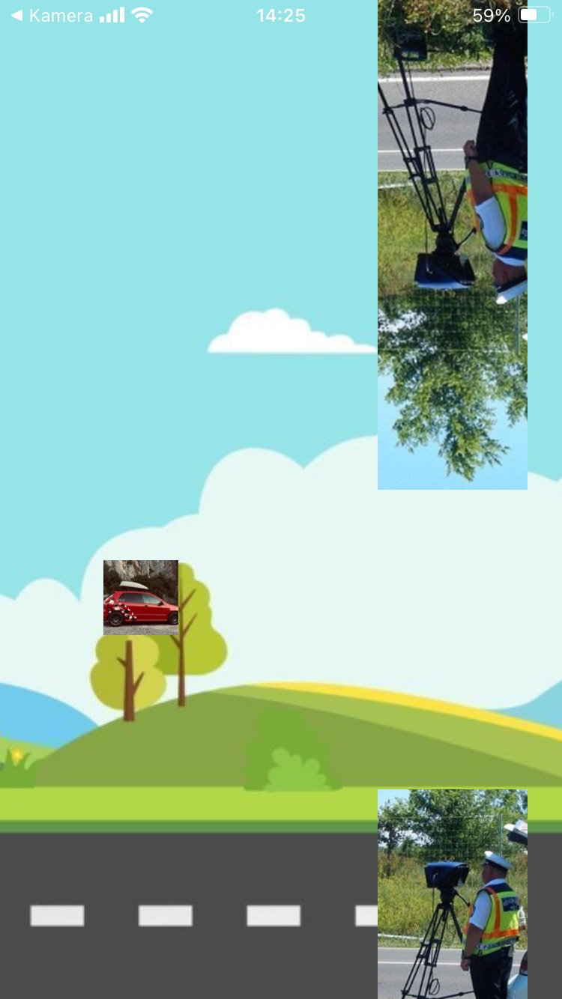

# BrainRotGame
<p align="center">
  
    

</p>
BrainRotGame is a Flappy Bird-inspired game where you control a car that must jump between obstacles (represented as speed cameras) without crashing. The game is built using React Native and Matter.js, providing a fun and challenging experience.

## Features

- **Car as the main character**: Instead of a bird, you control a car.
- **Speed camera obstacles**: Navigate between speed cameras taking pictures.
- **Physics-based gameplay**: Powered by Matter.js for realistic movement and collision detection.
- **Dynamic pipe generation**: Obstacles are randomly generated for a unique experience every time.
- **Game over detection**: The game ends when the car collides with an obstacle.

## Screenshots


## Installation

1. Clone the repository:
   ```bash
   git clone https://github.com/your-username/brainrotgame.git
     ```
2. Navigate to the project directory:
     ``` cd brainrotgame   ```
3. Install dependencies:
    ```npm install ```
## Start the development server:
***How to Play***
- Tap the screen to make the car jump.
- Avoid colliding with the speed cameras.
- Survive as long as possible to achieve a high score.

## Project Structure:
```
brainrotgame/
├──                # Main application file
├──               # Car component
├──          # Game constants (screen size, pipe dimensions, etc.)
├──            # Physics logic for the game
├──               # Basic wall component
├──              # Wall with a background image
├──              # Another wall with a different background image
├── assets/              # Game assets (images, icons, etc.)
├──          # Project configuration and dependencies
└── .gitignore           # Git ignore file
```
## Dependencies
- **React Native**
- **Matter.js**
- **React Native Game Engine**
- **Expo**
